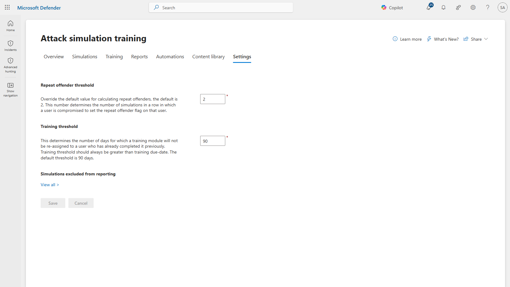
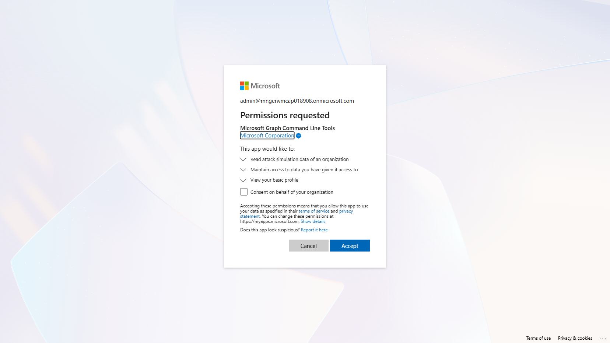
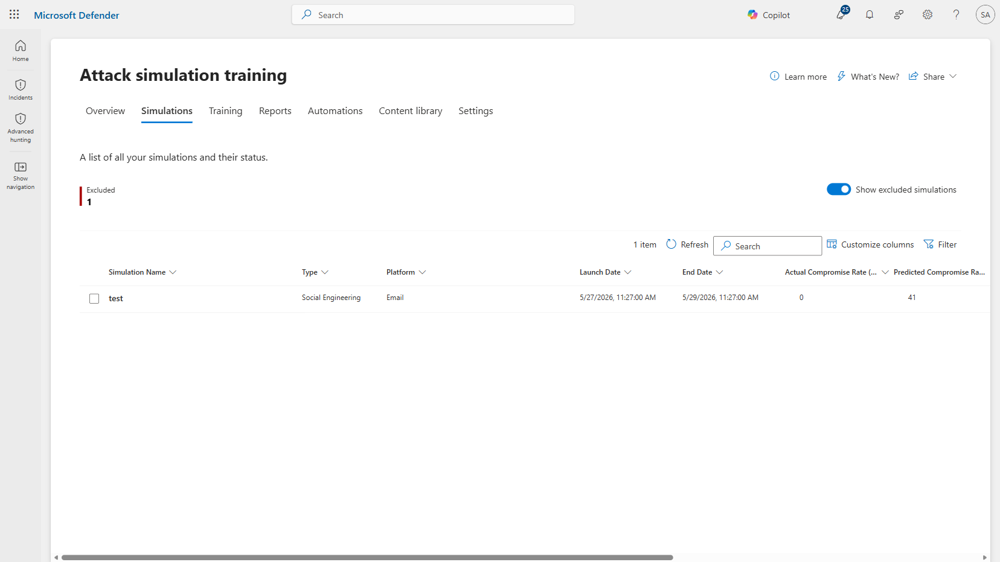

# Attack Simulator Repeat Offenders

Build a **repeat offender** list from Microsoft Defender for Office 365 Attack simulation training using **your own definition** — not the fixed one built into the portal.

---

## The problem

Defender has a built-in *Repeat offender threshold* setting under **Attack simulation training → Settings**. Read its description carefully:



> *"This number determines the number of simulations **in a row** in which a user is **compromised** to set the repeat offender flag on that user."*

Two words define — and limit — the whole feature:

| Word | Meaning | Consequence |
|---|---|---|
| **in a row** | Simulations must be consecutive | Someone who clicks in January and again in June is never flagged |
| **compromised** | Credentials must be supplied | Someone who clicks the link but doesn't type their password is invisible |

And there is **no time window at all** — you cannot express "in the last 12 months."

You can change the *number* (default 2). You cannot change the trigger, the sequence requirement, or add a window.

### Why that matters

Many organisations define a repeat offender differently. A common one:

> *"Anyone who clicked a phishing link **2 or more times in the last 12 months**, consecutive or not, whether or not they went on to enter credentials."*

That definition is not expressible in the portal. A user who clicks repeatedly but never surrenders credentials — arguably exactly who awareness training is for — will not appear on the built-in list.

This script produces that list from the Microsoft Graph attack simulation API, where the underlying per-user events are available.

---

## What it does

Reads every simulation and every per-user event, then applies **your** rule:

```
N or more EmailLinkClicked events, within a rolling window, in any order
```

It also prints what the built-in definition would have returned, so the difference is visible rather than asserted.

---

## Requirements

| | |
|---|---|
| **Licence** | Microsoft Defender for Office 365 Plan 2, or Microsoft 365 E5 |
| **Module** | `Microsoft.Graph.Authentication` |
| **Graph scope** | `AttackSimulation.Read.All` (delegated) |
| **Entra role** | Global Reader **or** Security Reader (least privilege — the script only reads) |

Also accepted: Security Operator, Security Administrator, Attack Simulation Administrator, Global Administrator.

```powershell
Install-Module Microsoft.Graph.Authentication -Scope CurrentUser
```

### A note on consent vs. role

These do different jobs and are often confused:

- **Consent** lets the app *ask* Graph for the data
- **Your Entra role** decides *how much* comes back

A user with consent but no security role gets nothing, so granting consent is not a backdoor.

`AttackSimulation.Read.All` is an **admin-consent** permission. The first person to run this in a tenant sees this prompt:



Note three things:

1. **The app is `Microsoft Graph Command Line Tools`**, published and verified by Microsoft Corporation. The script does not register an application of its own — it uses this first-party Microsoft client.
2. **`Read attack simulation data of an organization`** is the only meaningful permission requested. It is read-only.
3. **The checkbox matters.**

| Checkbox | Result |
|---|---|
| ☑ **Ticked** | Tenant-wide. Anyone with a qualifying Entra role can run the script from then on. |
| ☐ Not ticked | Only that one admin can ever run it. Everyone else is blocked and must go back to an admin each time. |

Tick it. Consent is then recorded permanently and nobody sees this screen again — though users will still **sign in** normally when their token expires. Signing in and consenting are different things.

---

## Usage

The script connects to Graph itself. You do **not** need to run `Connect-MgGraph` first.

```powershell
# Interactive - prompts for the window and threshold
.\Get-AttackSimRepeatOffenders.ps1

# Explicit - no prompts, suitable for a scheduled task
.\Get-AttackSimRepeatOffenders.ps1 -Window 12m -ClickThreshold 2 -TenantId <tenant-guid>

# Last 90 days
.\Get-AttackSimRepeatOffenders.ps1 -Window 90d
```

> **Always pass `-TenantId`.** On a machine signed into more than one tenant, a stale Graph session will otherwise be reused silently and you may report on the wrong tenant. The script warns if you omit it.

### The window accepts plain language

| Input | Meaning |
|---|---|
| `90d` / `90 days` | 90 days |
| `6w` / `6 weeks` | 6 weeks |
| `12m` / `12 months` | 12 months |
| `2y` / `2 years` | 2 years |
| `12` | 12 months (bare number = months) |

Case and spaces are ignored. Maximum look-back is 10 years.

### Parameters

| Parameter | Default | Description |
|---|---|---|
| `-Window` | prompts (`12m`) | Rolling look-back period |
| `-ClickThreshold` | prompts (`2`) | Clicks required to qualify |
| `-TenantId` | — | Entra tenant GUID. Strongly recommended. |
| `-OutFolder` | `~\Downloads` | Where the CSV files are written |
| `-IncludeExcludedSims` | off | Include simulations marked *excluded from reporting* (normally admin tests) |

---

## Example run

```
=============================================================
 Attack Simulator Repeat Offenders - define your rule
=============================================================
 Built-in Defender rule : N CONSECUTIVE sims, CREDENTIALS SUPPLIED
 This report            : N LINK CLICKS in a rolling window, any order

How far back? (e.g. 90d, 6w, 12m, 2y)  [default: 12m]: 2y
How many clicks qualify a user?  [default: 2]:

  Rule: 2 or more clicks in the last 2 years

Connected: admin@contoso.onmicrosoft.com  |  Tenant: 00000000-0000-0000-0000-000000000000

Reading simulations...
  (skipping 1 simulation(s) excluded from reporting)
  8 simulation(s) in scope
  - Q3 Credential Harvest           2026-08-25
  - Payroll Update Lure             2026-06-12
  - Invoice Attachment Test         2025-07-16
  15 user event(s) collected

Rule: 2+ clicks since 2024-09-09 (last 2 years)

================= REPEAT OFFENDERS =================

User                     ClickCount LastClick        DaysSinceLastClick EverCompromised TrainingOutstanding
----                     ---------- ---------        ------------------ --------------- -------------------
jane.doe@contoso.com              2 2026-08-25 14:24                 15            True                   2

1 user(s) matched  |  9 supporting event(s)
  SUMMARY    (one row per user)      : ...AttackSimRepeatOffenders_2clicks-2y_2026-09-09_SUMMARY.csv
  EVIDENCE   (per-event audit trail) : ...AttackSimRepeatOffenders_2clicks-2y_2026-09-09_EVIDENCE.csv
  TARGETLIST (upload to portal)      : ...AttackSimRepeatOffenders_2clicks-2y_2026-09-09_TARGETLIST.csv

--- For comparison, built-in basis (credential compromise) ---
  No user compromised in 2+ simulations - built-in list would be empty.
```

Note the last two lines. Same data, same tenant: this rule finds a user, the built-in rule finds nobody. That user clicked in two separate simulations but only supplied credentials once.

---

## Output

Three files, because they serve three different audiences. File names encode the rule and run date, so a file found months later still explains itself:

```
AttackSimRepeatOffenders_2clicks-12m_2026-09-09_SUMMARY.csv
AttackSimRepeatOffenders_2clicks-12m_2026-09-09_EVIDENCE.csv
AttackSimRepeatOffenders_2clicks-12m_2026-09-09_TARGETLIST.csv
```

### 1. SUMMARY — one row per flagged user

For review and reporting.

```
User                : jane.doe@contoso.com
DisplayName         : Jane Doe
ClickCount          : 2
FirstClick          : 2025-07-16 15:37
LastClick           : 2026-08-25 14:24
DaysSinceLastClick  : 15
EverCompromised     : True
CredsSuppliedCount  : 1
TimesReportedPhish  : 0
SimsTargeted        : 2
ClickRatePct        : 100
Techniques          : credentialHarvesting
TrainingAssigned    : 2
TrainingCompleted   : 0
TrainingOutstanding : 2
DistinctIPs         : 203.0.113.24; 198.51.100.7
Devices             : Windows NT 10.0; Win64; x64
Browsers            : Edge
Simulations         : Q3 Credential Harvest; Invoice Attachment Test
```

Some columns worth knowing:

- **ClickRatePct** — 2 clicks out of 3 simulations is a very different risk profile from 2 out of 40
- **TimesReportedPhish** — someone who also *reports* phishing is engaged, just occasionally caught out
- **TrainingOutstanding** — did they ignore the training assigned last time?

Sorted by click count, then by outstanding training, so the worst cases surface first.

### 2. EVIDENCE — one row per individual click

Timestamp to the second, plus IP address, browser and device.

```
EventName    : EmailLinkClicked
EventTime    : 2025-07-16 15:37:13
IpAddress    : 203.0.113.24
Browser      : Edge
Device       : Windows NT 10.0; Win64; x64
Simulation   : Invoice Attachment Test
Technique    : credentialHarvesting
```

Defender does not record what a user typed into a simulated login page, so this who/when/where detail is the strongest evidence available when someone disputes a finding.

### 3. TARGETLIST — the upload file

Bare email addresses, one per line. No header, no quotes, no BOM.

```
jane.doe@contoso.com
john.smith@contoso.com
```

> **This format is mandatory.** The Defender portal Import control expects one email address per line. A normal `Export-Csv` file is rejected with *"Unable to retrieve email-addresses from uploaded file"* because the header row is read as an address.

---

## Using the output

Upload `..._TARGETLIST.csv` at either of:

- **Training campaigns** → Create → **Target users** → **Import**
- **Simulations** → Launch a simulation → **Target users** → **Import**



### Making it self-maintaining

Uploading a CSV each cycle is still manual. To remove that step:

1. Create a mail-enabled security group, e.g. `sec-phish-repeat-offenders`
2. Schedule this script monthly and sync group membership from its output via Graph
3. Point the training campaign at the **group** once

Membership then maintains itself — users are added when they meet the threshold and drop out when their older clicks age past the window.

> Attack simulation training supports targeting Microsoft 365 Groups (static and dynamic), distribution groups (static), and mail-enabled security groups (static).

Custom **user tags** are a poor fit for this: they cannot be managed by PowerShell, take up to 8 hours to apply, and a group assigned to a tag is a one-time snapshot that does not stay in sync.

---

## How it works

```
GET /v1.0/security/attackSimulation/simulations
GET /v1.0/security/attackSimulation/simulations/{id}/report/simulationUsers
```

The second call returns per-user events. The relevant ones:

| Event | Meaning |
|---|---|
| `SuccessfullyDeliveredEmail` | Simulation arrived |
| `MessageRead` | User opened it |
| **`EmailLinkClicked`** | **User clicked — this script's trigger** |
| **`CredSupplied`** | **User entered credentials — the built-in trigger** |
| `TrainingAssignmentMessageDelivered` | Training assigned |

The gap between the last two rows is the entire reason this script exists.

---

## Limitations

- There are no PowerShell cmdlets for Attack simulation training; Graph is the only programmatic route
- Defender XDR Unified RBAC does not currently apply to attack simulation training — the Entra roles above are what matter
- Only simulations still retained by the service can be reported on
- The built-in comparison in the output counts *total* credential compromises rather than strictly consecutive ones, so it **overstates** what the built-in feature would flag. The real built-in list is the same length or shorter.

---

## Author

**Dr. Muataz Awad**
Principal Cloud Solution Architect — Security

---

## Disclaimer

Provided as-is, with no warranty. Not an official Microsoft product. Test in a non-production tenant first.
